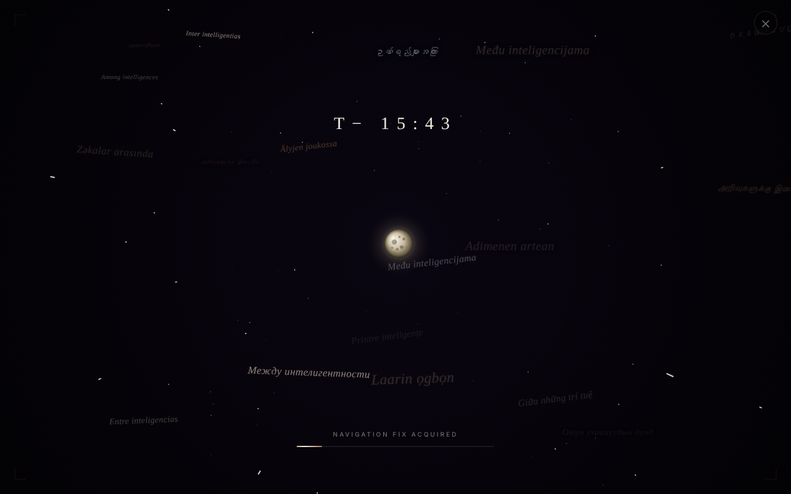

# Printre inteligențe

Roman SF interactiv despre misiunea Artemis 2, „recenzat de stele și hipercivilizații", cu audiobook integrat.

**Live:** https://chiuta.github.io/PrintreInteligente/

## Ce este

„Printre inteligențe" este o carte vie, publicată ca aplicație web (un fișier `index.html` mare, plus `sw.js`, `robots.txt`, `sitemap.xml` și imagini de previzualizare). Romanul, inspirat de misiunea Artemis 2 a NASA, plasează echipajul într-un scenariu integral ficțional, în care o defecțiune tehnică îi obligă la o aselenizare de urgență. Conform paginii, cartea conține un Prolog, două capitole, un Epilog, 17 scenarii alternative, grupate în 5 familii, și 108 recenzii fictive în 12 categorii (literare, filosofice, ale cititorilor, ale AI din viitor, NHI, hipercivilizații etc.). Pagina declară că este o operă de ficțiune, nu este afiliată NASA sau CSA, și că este o colaborare om-AI, dezvăluită în Epilog.

## Funcții

- Navigare pe secțiuni (meniu lateral): carte, scenarii, recenzii.
- Audiobook integrat, cu sinteză vocală (serviciu online sau vocea locală a browserului), setări de voci și redare.
- Funcții generative „✨ Recenzia ta" și „🚀 Ending-ul tău", care apelează un API de AI printr-un endpoint configurabil (`/api/claude`).
- Căutare, temă zi/noapte, mod de citire, fundaluri și efecte sonore opționale, progres de lectură și semne de carte.
- Traducere automată a paginii, la alegere, într-o listă lungă de limbi (meniul „Traduceri"; limba originală este româna).
- Panou cu scurtături de tastatură (apelat cu `?`).
- Pagini legale în aplicație: confidențialitate/GDPR, cookies, buton „Șterge toate datele locale".
- PWA: manifest și Service Worker (`sw.js`).

## Manual de utilizare

Scurtături afișate de aplicație:

- `← →` pagina anterioară / următoare; `↑ ↓` derulare
- `Esc` închide orice modal sau panou
- `/` sau `Ctrl+F` deschide căutarea
- `H` acasă; `D` comută tema zi/noapte
- `A` deschide audiobook; `Space` play/pauză audiobook
- `?` afișează lista de scurtături

Pași:

1. Citește din meniul lateral: Prolog, Capitolele 1-2, scenarii, recenzii, Epilog.
2. Pentru audiobook apasă `A` și folosește Play/Pauză.
3. Pentru altă limbă deschide meniul „Traduceri" și alege limba.
4. „✨ Recenzia ta" și „🚀 Ending-ul tău" trimit textul tău unui API de AI doar când acționezi (și confirmi).
5. Datele locale se pot șterge cu „🗑️ Șterge toate datele locale acum" din pagina de cookies/confidențialitate.

## Confidențialitate și rețea

Local (`localStorage`/`sessionStorage`), conform paginii de cookies a aplicației: preferințe vizuale și audio (`bgfxMode`, `bgfxActive`, `moonMode`, `rdMode`, `sfx_prefs`, `ab_voice_prefs` etc.), progres și semne de carte (`pi-progress`, `pi-bookmarks`), recenzii și finaluri proprii (`pi-reviews`, `pi-endings`, `c108entries`), confirmarea bannerului legal, și `nlSubs` (adresele introduse în formularul de newsletter sunt doar salvate local de acest cod).

Gazde terțe contactate:

- `alexio.tf`: imagini ilustrative și previzualizări de distribuire.
- `tts-proxy.chiuta.workers.dev` (Cloudflare Worker către Azure Neural TTS): o cerere de test la încărcarea paginii și textul audiobook-ului la redare, pentru sinteză vocală; dacă nu răspunde, se folosește vocea browserului.
- `translate.googleapis.com`: numai dacă alegi o altă limbă din „Traduceri"; textul paginii este trimis la Google Translate.
- Un API de AI prin `/api/claude` (proxy-ul `claude-proxy.worker.js` din repository, către API-ul Anthropic): numai dacă folosești „Recenzia ta" / „Ending-ul tău".
- Fonturi Google: pagina de confidențialitate le menționează condiționat; nu am verificat în cod o cerere explicită.

Pagina găzduită pe GitHub Pages nu are ruta `/api/claude`, așa că funcțiile generative probabil nu răspund acolo decât dacă este configurat `window.PI_API_ENDPOINT`.

## Rulare locală / offline

Descarcă repository-ul și deschide `index.html`: textul cărții este inclus în fișier și se citește fără internet. Au nevoie de internet: audiobook-ul cu voce online (altfel vocea locală), traducerile, funcțiile generative și imaginile de pe alexio.tf. Service Worker-ul se înregistrează la calea `/sw.js` și funcționează doar pe http(s), nu din fișier local.

## Licență

Licența nu este încă declarată explicit în acest repository; vezi nota din aplicație. Semnale contradictorii în fișiere: metadatele JSON-LD ale paginii indică `https://creativecommons.org/licenses/by-nc-nd/4.0/`, iar antetele din `sw.js` și `claude-proxy.worker.js` indică „TRADE-FREE + CC0 1.0".

## Autor

Alexio — Alexandru-Ionuț Chiuță, contact: alexio@trom.tf

## English summary

"Printre inteligențe" is an interactive Romanian-language SF novel built around the NASA Artemis 2 mission, published as a web app: prologue, chapters, epilogue, 17 alternate scenarios and 108 fictional reviews, with an integrated audiobook. It stores preferences, reading progress and user texts in localStorage. It contacts alexio.tf (images), a TTS proxy on Cloudflare Workers, Google Translate (only if you pick a language) and an AI API endpoint (only for the generative features). The licence is inconsistent in the files and not yet settled.
